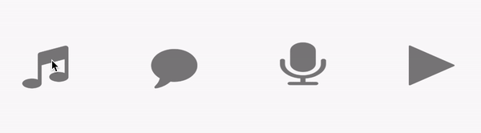
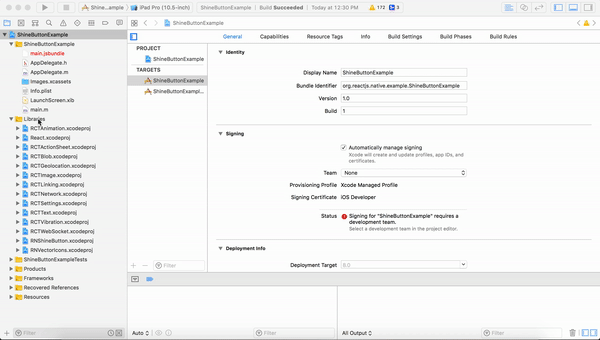
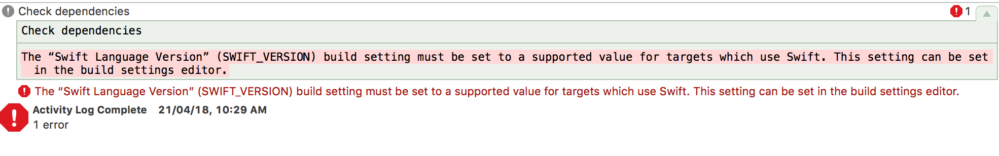
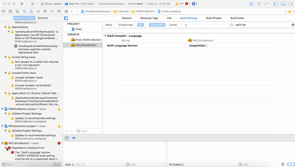

<h1 align="center">

<p align="center">
  <a href="https://www.npmjs.com/package/react-native-shine-button"></a>
  <a href="https://github.com/prscX/react-native-shine-button/pulls"></a>
  <a href="https://github.com/prscX/react-native-shine-button#License"></a>
</p>


    ReactNative: Native Shine Button (Android/iOS)

If this project has helped you out, please support us with a star 🌟
</h1>

This library is a React Native bridge around native Siri wave animation:


| **[Android: ChadCSong/ShineButton](https://github.com/ChadCSong/ShineButton) & [iOS: imwcl/WCLShineButton](https://github.com/imwcl/WCLShineButton)**             |
| ----------------- |
|                   |

|              |
| ----------------- |
|                   |


## 📖 Getting started

- `$ npm install react-native-shine-button --save`

- `$ react-native link react-native-shine-button`

- `$ react-native link react-native-vector-icons`


#### Android

- Please add below snippet to `defaultConfig` in your app `build.gradle`file. This is with respect to [ISSUE: 1](https://github.com/prscX/react-native-shine-button/issues/1):

```
jackOptions {
    enabled true
}
```

- Please add below snippet above `dependencies` in your app `build.gradle`:

```
buildscript {
    repositories {
        jcenter()
        google()
        maven { url "https://jitpack.io" }
    }

}

allprojects {
    repositories {
        jcenter()
        google()
        maven { url "https://jitpack.io" }
    }
}
```
> **Note:** This library is supported on Android SDK 27 > above


#### iOS
- Run Command: `cd ../node_modules/react-native-shine-button/ios && pod install`. If it has error => try `pod repo update` then `pod install`

- Add WCLShineButton.framework in Embedded Binaries & Linked Frameworks and Libraries. You can find this library from below path:

    `node_modules/react-native-shine-button/ios/WCLShineButton/WCLShineButton.xcodeproj`

    

- Now build your iOS app through Xcode

- If you receive below error, please check video below in order to resolve the same:

    

    **SOLUTION**

    


## 💻 Usage

```javascript
import RNShineButton from 'react-native-shine-button';

<RNShineButton shape={"heart"} color={"#808080"} fillColor={"#ff0000"} size={100} />

```


## Vector Icons Usage
Now you can even provide custom vector icons by using [react-native-vector-icons](https://github.com/oblador/react-native-vector-icons). Please use below snippet:

```javascript
import RNShineButton from 'react-native-shine-button';
import Icon from 'react-native-vector-icons/FontAwesome'

let music = <Icon family={"FontAwesome"} name={"music"} color={"#808080"} />;

<RNShineButton shape={music} color={"#808080"} fillColor={"#ff0000"} size={100} />

```

> **Note:**
> - We have added `family` prop for `Icon` class, please make sure that you pass the props


## 💡 Props


| Prop              | Type       | Default | Note                                                                                                       |
| ----------------- | ---------- | ------- | ---------------------------------------------------------------------------------------------------------- |
| `shape`           | `string OR react-native-vector-icons`     |         | The type of Shine Button you want. It's props are heart, like, star, smile. Even you are specify a react-native-vector-icons |
| `color`       | `string: HEX-COLOR`     |         | Color which you want then the Shine Button is not active                                                            |
| `fillColor`     | `string: HEX-COLOR` |         | Fill Color then the Shine Button is clicked                                                      |
| `size` | `number` |         | Size of Shine Button                                                   |  |
| `disabled`    | `bool`     |         | Disabling the Shine Button                                        |  |
| `value`      | `bool`     |         | Default value whether it is selected or not
| `onChange`      | `func`     |         | It is invoke then the value of shine button is change


## ✨ Credits

- Android lib [ChadCSong/ShineButton](https://github.com/ChadCSong/ShineButton) Android implement. 
- iOS lib [imwcl/WCLShineButton](https://github.com/imwcl/WCLShineButton) iOS implement

## 🤔 How to contribute
Have an idea? Found a bug? Please raise to [ISSUES](https://github.com/prscX/react-native-bottom-action-sheet/issues).
Contributions are welcome and are greatly appreciated! Every little bit helps, and credit will always be given.

## 💫 Where is this library used?
If you are using this library in one of your projects, add it in this list below. ✨


## 📜 License
This library is provided under the Apache 2 License.

RNShineButton @ [prscX](https://github.com/prscX)

## 💖 Support my projects
I open-source almost everything I can, and I try to reply everyone needing help using these projects. Obviously, this takes time. You can integrate and use these projects in your applications for free! You can even change the source code and redistribute (even resell it).

However, if you get some profit from this or just want to encourage me to continue creating stuff, there are few ways you can do it:
* Starring and sharing the projects you like 🚀
* If you're feeling especially charitable, please follow [prscX](https://github.com/prscX) on GitHub.

  <a href="https://www.buymeacoffee.com/prscX" target="_blank"></a>

  Thanks! ❤️
  <br/>
  [prscX.github.io](https://prscx.github.io)
  <br/>
  </ Pranav >