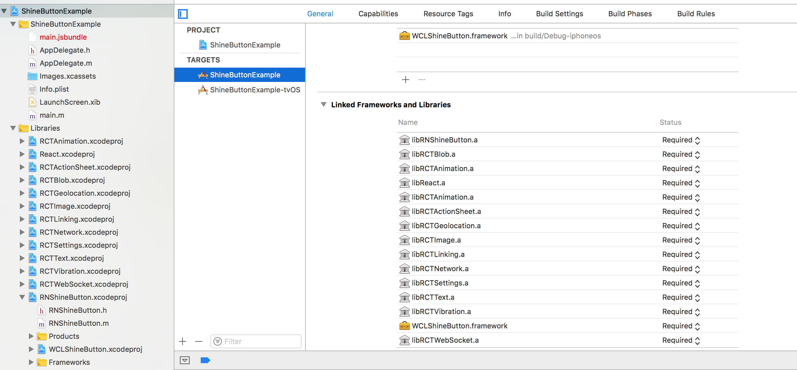

<p align="center">
  
</p>

<p align="center">
  <a href="https://www.npmjs.com/package/react-native-shine-button"></a>
  <a href="https://github.com/prscX/react-native-shine-button/pulls"></a>
  <a href="https://github.com/prscX/react-native-shine-button#License"></a>
</p>


# React Native: Shine Button (Android/iOS)

React Native Bridge for native [ChadCSong/ShineButton](https://github.com/ChadCSong/ShineButton) & [imwcl/WCLShineButton](https://github.com/imwcl/WCLShineButton). Effects like shining.

## Getting started

- `$ npm install react-native-shine-button --save`

- `$ react-native link react-native-shine-button`

#### Android

- Please add below snippet to `defaultConfig` in app `build.gradle`file. This is with respect to [ISSUE: 1](https://github.com/prscX/react-native-shine-button/issues/1):

```
jackOptions {
    enabled true
}
```

#### iOS
- Add WCLShineButton.framework in Embedded Binaries & Linked Frameworks and Libraries. You can find this library from below path:

`node_modules/react-native-shine-button/ios/WCLShineButton/WCLShineButton.xcodeproj`



## Usage

```javascript
import RNShineButton from 'react-native-shine-button';

<RNShineButton shape={"heart"} color={"#808080"} fillColor={"#ff0000"} size={50} />

```

## Props


| Prop              | Type       | Default | Note                                                                                                       |
| ----------------- | ---------- | ------- | ---------------------------------------------------------------------------------------------------------- |
| `shape`           | `JSON`     |         | The type of Shine Button you want. It's props are heart, like, star, smile |
| `color`       | `JSON`     |         | Color which you want then the Shine Button is not active                                                            |
| `fillColor`     | `Function` |         | Fill Color then the Shine Button is clicked                                                      |
| `size` | `Function` |         | Size of Shine Button                                                   |  |
| `disabled`    | `bool`     |         | Disabling the Shine Button                                        |  |
| `value`      | `bool`     |         | Default value whether it is selected or not
| `onChange`      | `func`     |         | It is invoke then the value of shine button is change


## Credit
- Android lib [ChadCSong/ShineButton](https://github.com/ChadCSong/ShineButton) Android implement. 
- iOS lib [imwcl/WCLShineButton](https://github.com/imwcl/WCLShineButton) iOS implement

## Contribution
Contributions are welcome and are greatly appreciated! Every little bit helps, and credit will always be given.


## License
Copyright @ Pranav Raj Singh Chauhan

RNShineButton is provided under the Apache License.

